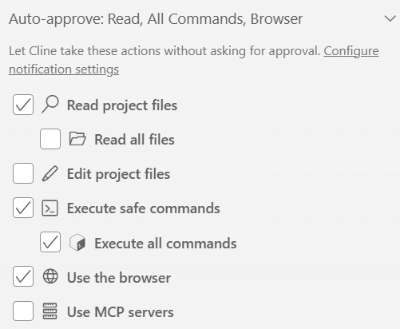

# Clineの基本とプロンプトエンジニアリング

---

## Clineの基本的な利用方法

### ActモードとPlanモードの使い分け

#### Actモード（実行モード）
- すぐにコードの変更・実行を開始する  
- 明確なタスクで即座に作業を進めたい場合に使用  
- 実装方針が決まっており、短時間で進めたい時に最適  

#### Planモード（計画モード）
- 実行前にClineが計画（Plan）を立て、内容を確認できる  
- 複雑なタスクや不明点のある依頼時に使用  
- ステップバイステップで提案を確認・修正できる  
- 大規模変更や安全性を重視する際に推奨  

---

### 2. Clineの仕組みと操作

#### Clineの動作の仕組み
Clineにプロンプトで指示を与えると、以下の流れで処理が実行されるます：

1. **LLMへの問い合わせ**：プロンプトがLLMに送信される
2. **ツールの選択**：LLMが必要な操作を判断し、適切なツールを選択
3. **操作の実行**：選択されたツールを使って実際の操作を実行

#### Clineが実行できる操作

##### ファイル操作
- ファイルの読み込み・編集・作成・削除  
- ディレクトリ検索（grep相当）  

##### ターミナル操作
- npm、pip、gitなどのコマンドを実行  
- ビルド・テスト・サーバー起動なども可能  
- 出力結果をコンテキストとしてClineに渡せる  

##### ブラウザ操作
- WebドキュメントやAPI仕様の閲覧  
- スクリーンショット取得・Web動作確認    

#### 操作の権限管理
- それぞれの操作には**権限が必要**
- 初回実行時や重要な操作では権限の設定が求められる
- セキュリティとコントロールのバランスを考慮した運用が重要

##### Auto-approve（自動承認）設定

- Actモード中に、**変更を手動承認するか自動で適用するか**を切り替え可能  
- 自動適用をオンにすると、変更確認なしで即反映  
- 信頼できるタスクや単純な修正時に便利  
- 重要な変更時は、確認を挟む設定（手動承認）を推奨  

---

### 3. ファイル変更の承認フロー

#### 承認の流れ
- ファイルが変更された場合、以下のフローで承認を行う：
  - **Saveボタン**：変更を承認・適用  
  - **Rejectボタン**：変更を拒否・再提案を依頼  
- エディタ上で変更内容を確認しながら判断  
  - **緑（Green）**：追加された行  
  - **赤（Red）**：削除された行  

#### 確認のポイント
- コードの意図が正しいか  
- 副作用やセキュリティ影響がないか  
- 既存機能や依存関係への影響を確認  

---

### 4. 変更を元に戻す方法

#### 方法1：Clineの履歴機能を使う
- 「元に戻して」「Undo」などと指示することで、Clineがセッション内の変更を復元  
- セッション内であれば、Gitを使わずに元に戻せる  

#### 方法2：Gitで復元（推奨）
- `git diff` でClineの変更を確認  
- `git checkout <ファイル>` や `git reset --hard` で元に戻す  
- VSCodeのGitタブからもGUIで確認可能  
- セッションをまたいだ変更や複雑な修正はGitでの管理が安全  

#### 安全な運用のポイント
- 作業前に `git commit` でスナップショットを残す  
- 実験的な作業は `git checkout -b <ブランチ名>` でブランチを作成  
- Cline履歴＋Git履歴の二重管理で安心  

---

### 5. コンテキストの追加方法

#### ファイルやフォルダを追加
- **Shift + ドラッグ＆ドロップ**でファイル／フォルダをコンテキストに追加  
- 複数選択にも対応  

#### @記号で追加
- チャット欄で `@` を入力すると候補一覧が表示  
- **@file**：特定ファイルを追加  
- **@folder**：フォルダ全体を追加  
- **@terminal**：ターミナル出力を追加  

---

### 6. ワークフロー機能の活用

#### 概要
- 定型タスクをショートカットで実行できる機能  
- 「/」を入力すると利用可能なワークフロー一覧が表示される（バージョン依存）  

#### 配置場所
- `.clinerules/workflows/` フォルダに配置  
- YAML または Markdown で定義可能  

#### 活用例
- コードレビューリクエスト  
- テストコード生成  
- ドキュメント作成  
- デプロイチェックリスト  

---

### 7. .clinerules設定

#### .clinerulesとは
- プロジェクトごとのルールやガイドラインを定義する設定ファイル  
- プロジェクトルートに配置し、Clineの動作基準を統一  

#### 設定内容の例
- **コーディング規約**：言語スタイル・命名ルール  
- **禁止事項**：使用禁止ライブラリ・関数  
- **推奨事項**：デザインパターンや構成指針  
- **テスト要件**：カバレッジやフレームワーク指定  
- **ドキュメント方針**：READMEやコメント整備ルール  

#### メリット
- 一貫したAI提案・コード生成が可能  
- チーム開発での統一ルール維持  
- 新メンバーのオンボーディングが容易  

---

### まとめ

#### Cline活用のポイント
1. **ActモードとPlanモード**：タスクの性質に応じて使い分け（明確なタスク→Act、複雑なタスク→Plan）
2. **Clineの仕組みと操作**：LLM → ツール選択 → 操作実行の流れを理解し、ファイル・ターミナル・ブラウザ操作を活用。権限管理とAuto-approveを状況に応じて設定
3. **ファイル変更の承認フロー**：エディタの差分表示（緑：追加、赤：削除）で確認し、Save/Rejectで承認。コードの意図・副作用・依存関係を必ずチェック
4. **変更を元に戻す方法**：Clineの履歴機能またはGitで復元。作業前に `git commit` でスナップショットを残す習慣を
5. **コンテキストの追加方法**：Shift + ドラッグ&ドロップまたは @記号（@file、@folder、@terminal）で必要な情報を追加
6. **ワークフロー機能の活用**：定型タスク（コードレビュー、テスト生成等）を `.clinerules/workflows/` に定義して効率化
7. **.clinerules設定**：プロジェクトのコーディング規約・禁止事項・推奨事項を定義し、一貫したAI提案を実現

---

## プロンプトエンジニアリングの要諦

### プロンプトの抽象度とトレードオフ

#### 抽象的なプロンプト
- **作成負荷**：小さい（短く簡単）
- **AI委譲範囲**：広い（AIが多くを判断）
- **精度**：ばらつきが生じる
- **使いどころ**：探索的な作業、方向性を決める段階

#### 具体的なプロンプト
- **作成負荷**：大きい（詳細な記述が必要）
- **AI委譲範囲**：小さい（人間が多くを指定）
- **精度**：向上する
- **使いどころ**：明確な要件、本番コード、重要な修正

#### 最適なバランスを見極める
- ユースケースに応じて抽象と具体のバランスを調整（万能なレベルは存在しない）
- **コストパフォーマンス**が最も良いポイントを探す（プロンプト作成時間 vs 出力精度のトレードオフ）
- タスクの性質・重要度・時間制約を考慮

#### レビューとの兼ね合い
- AI駆動開発では「レビューアの負担が重くなる」という課題がある
- レビューには必ず「観点」があるため、それを適切にプロンプトに反映させることが重要
ｰ Clineの場合は、/clinerulesでレビューの観点（設計標準やコーディング規約）を定義することができる

---

### プロンプトの抽象度・具体度に応じた分類（当研修固有）

#### Simple（最も抽象的）
- **特徴**：短く簡潔な指示
- **長さ**：最大でも20行程度
- **メリット**：素早く指示できる
- **デメリット**：出力のばらつきが大きい
- **適用場面**：探索・試作・アイデア出し

#### Just（バランス重視）
- **特徴**：必要十分な情報
- **長さ**：20行〜100行程度
- **メリット**：作成負荷と精度のバランスが良い
- **デメリット**：状況判断が必要
- **適用場面**：通常の開発タスクの大半

#### Much（最も具体的）
- **特徴**：詳細な仕様・制約・例を含む
- **長さ**：数百行
- **メリット**：高精度な出力
- **デメリット**：プロンプト作成に時間がかかる
- **適用場面**：本番実装、複雑な要件、品質重視

---

### 本研修におけるユースケース

* berry-books：Jakarta EEによるWebアプリケーション（オンライン書店）
  * レッスン1：小規模改善
  * レッスン2：ガイドラインへの準拠チェック
  * レッスン3：不具合修正
  * レッスン4：機能拡張
  * レッスン5：単体テスト生成
* berry-books-frontend：ReactによるSPA（オンライン書店の管理者画面）
  * レッスン6：仕様書からのスクラッチ開発（React）
* struts-to-jsf-person：StrutsからJSFへのマイグレーション
  * レッスン7：フレームワークのマイグレーション（リライト）
* accounting_glue：PySpark/GlueによるETL処理（会計EPRへのバッチデータ連携）
  * レッスン8：仕様書からのスクラッチ開発（PySpark/Glue）
  
---

## ご参考：プライベート環境での学習継続について

### セットアップ①：ツールおよび言語のインストール

* VSCode
* Cline（VSCodeプラグイン）
* Git
* JDK：JDK 21
* Python：Python 3.11

### セットアップ②：Gitリポジトリからのクローン

* リポジトリ名：KenyaSaitoh/cline_training_work
* Git（Git Bashなど）を起動し、以下のコマンドで任意のディレクトリにクローンする
  * `git clone https://github.com/KenyaSaitoh/cline_training_work.git
* リポジトリ内には各種ミドルウェア（Payara、Hsqldb、TomEEなど）が最初から配置されているためすぐに利用可能

### セットアップ③：API KEYの取得

* AnthropicのAPI KEYを以下のサイトより取得
  * https://console.anthropic.com/settings/keys
  * 5ドルの無料枠あり
* 取得したAPI KEYをClineに設定する